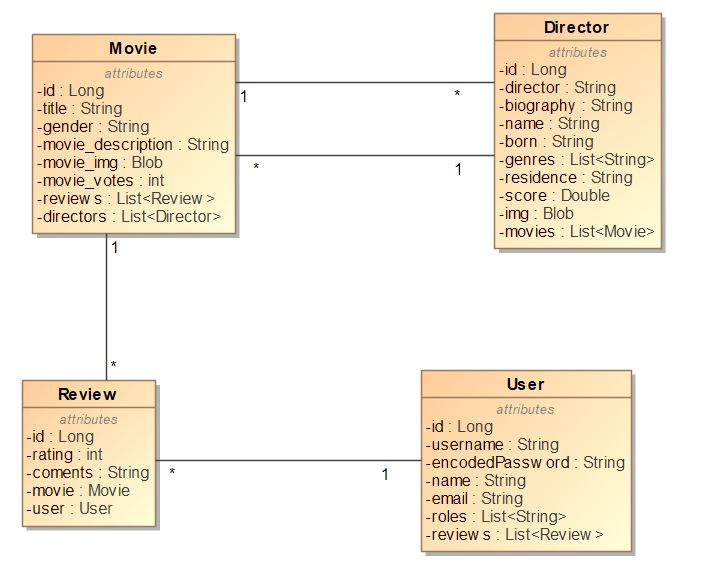
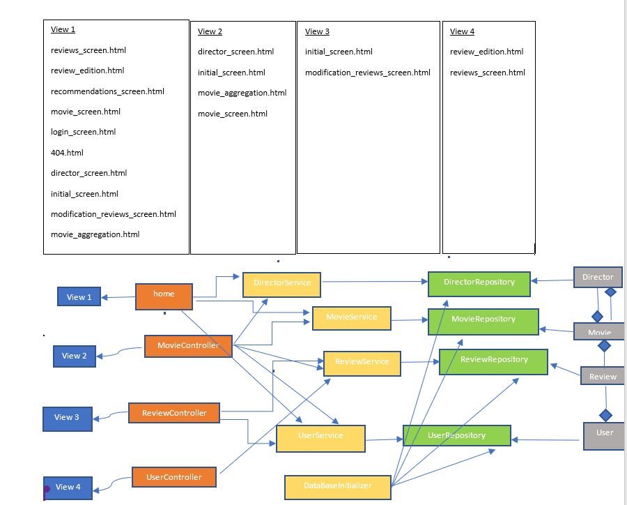
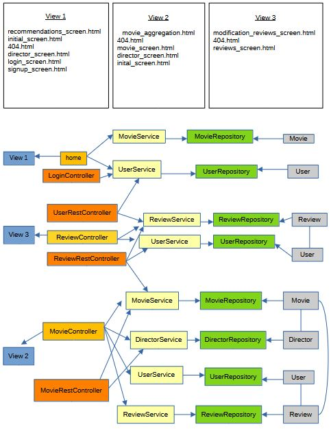
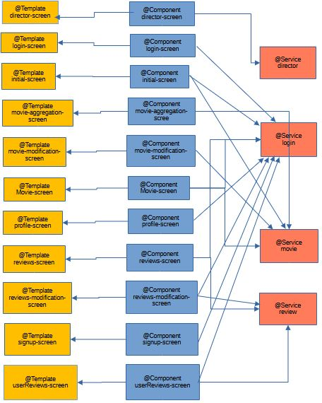

# **MovieFrame**

# FASE 1

| Nombre y apellidos | Correo | Cuenta github |
| --- | --- | --- |
| Maria Amparo Alami | ma.alami.2020@alumnos.urjc.es | MaAlami2020 |
| Cristobal Justo Rustarazo | c.justo.2019@alumnos.urjc.es | CristobalJR |
| Cassiel Seth Mayorca Heirisman | cs.mayorca.2018@alumnos.urjc.es | cassiel_smh |
| Javier García Seller | j.garcias.2020@alumnos.urjc.es | Javarto |
| Shadith Perez  Rivera | sy.perez.2022@alumnos.urjc.es | Shadith |

#### Zona de organizacion [Trello](https://trello.com/w/movieframe)

## **1. Entidades:**
  - Usuario
  - Película o serie
  - Autor de la película
  - Crítica o reseña

## **2. Usuarios:**
  * **_Anónimo_**: no introduce ninguna credencial en la aplicación, se le muestra la cartelera de las películas y series más recientes o mejor calificadas.
  * **_Registrado_**: se registra en la aplicación (nombre, nombre de usuario, email(para mandarle recomendaciones), foto y contraseña).
  * **_Administrador_**: es el primer usuario que se registra en la app (nombre, nombre de usuario, email(para mandarle recomendaciones), foto, contraseña). La contraseña está cifrada en un fichero de configuración 

## **3. Permisos de los usuarios:**
  * **_Anónimo_**: visualiza la cartelera (nombres de peliculas, personajes, fecha de estreno, calificación media, trailer de la peli o serie...), no puede subir reseñas ni visualizar las de otros
  * **_Registrado_**: visualiza la cartelera, agrega/edita reseñas, vota películas o series, visualizar el histórico de reseñas realizadas
  * **_Administrador_**:visualiza la cartelera, agrega/edita reseñas, vota películas o series, visualizar el histórico de reseñas realizadas, eliminar reseñas de usuarios registrados, información no verificada y añadir películas o series a la app.

## **4. Imágenes:**
  * Fotos de portada las películas y series, cortas escenas, fotos de su elenco

## **5. Gráficos:**
  * Películas más taquilleras 
  * Peliculas mas populares (Un diagrama que clasifique las películas según el número de votos o número de reseñas)
  * Directores, actices y demas con mas premios
  
## **6. Tecnología complementaria:**
  * Usar "Google Maps" para mostrar el/los cines donde se puede ver una determinada película
  * Notificaciones de actulizaciones de los autores, peliculas y demas que sigues
  * Generar un PDF con recomendaciones de series y películas (cartel incluido) y que este sea enviado a los usuários mediante un mail

## **7. Algoritmo avanzado:**
  * Usuario registrado:
    * _Si no ha publicado ninguna reseña_: se le muestra la cartelera de películas y series más recientes (fecha más actual)
    * _si lo ha hecho_: se le muestra la cartelera de películas y series de un estilo similar al de las ya reseñadas por el usuario (ordenados de fecha más reciente a menos)

## **8. Pantallas de la aplicación:**
  * **_initial_screen_**:  cartelera con películas seleccionadas por el administrador, un traíler de las películas cargadas, un botón para hacer iniciar sesión, y gráficos con información cuantitativa sobre las películas
  * **_director_screen_**: se muestra la información personal del sujeto junto con un listado de sus pelis dirigidas y una valoración media de su trabajo
  * **_login_screen_**: dispone de campos para iniciar sesión, y un botón para registrarse en caso de no poder iniciar sesión
  * **_modification_reviews_screen_**: en este pantalla se muestra el listado de reseñas de todos los usuarios registrados en la app con un boton de eliminar en cada una de ellas, solo el administrador puede acceder a ella.
  * **_movie_aggregation_screen_**:en este pantalla se muestra un listado de peliculas aleatorias en la app con un boton de agregar en cada una de ellas, solo el administrador puede acceder a esta página
  * **_recommendations_screen_**:la pantalla tiene un buscador para filtrar por correo y categoría de película para mandar a un usuario registrado películas como recomendación, solo el administrador tiene acceso a esta página
  * **_movie_screen_**:se muestra la información de una película, enlace a la pantilla del director, botón para volver a la página de incio, cuadro de texto para escribir una reseña y cuadro para enviar una votación, además de un mapa para buscar cines
  * **_reviews_screen_**:página donde un usuario registrado puede ver todas sus reseñas hechas desde la primera vez que se dió de alta en la app
  * **_signup_screen_**:página con cuadros de diálogo para meter información y foto(opcional), y botón para volver a la página de inicio


# FASE 2

## **1. Navegación:**

Navegación del usuaurio anónimo

.JPG)

Navegación del usuaurio registrado

.JPG)

Navegación del administrador

.JPG)
## **2. Instrucciones de ejecucción:**

Éstos serían los pasos para ejecutar el proyecto sin comandos:
1. clonar el proyecto 
2. incoporar el proyecto en Visual Studio Code con GitHub Desktop
3. instalar las dependencias de spring boot en el archivo pom.xml
4. en el archivo application.properties meter el usuario, contraseña con la que se registró en MySQL, otro usuario y contraseña que funciona como administrador y agregar el fichero keystore.jks
5. arrancar el proyecto con el dashboard
6. meter la url `https://localhost:8443` en navegador

Éstos serían los pasos a seguir en caso de utilizar comandos:

El proyecto requiere de una base de datos MySQL que se puede arrancar usando Docker con el comando `$Docker run --rm -e MySQL_ROOT_PASSWORD=password \ -e MYSQL_DATABASE=webapp3 -p 3306:3306 -d mysql:8.0`

La aplicación se ejecuta con el comando `mvn spring-boot:run`

El proyecto usa una base de datos MySQL:
* esquema: movieframe
* usuario: webapp3
* contraseña: Mundialmente1

Dentro de una de las tablas (user) de la base de datos se han almacenado usuarios de la aplicación por defecto, éstos son:

* usuario: `edward`, contraseña: `edu123456`
* usuario: `hughjackman`, contraseña cifrada: `$2a$12$9nJUxHrHgRXGWWpt8tfmteaIl1Ts0EPQ/0aIgswVXIMgp7kwWHbd`

La versión de java es la 17

## **3. Entidades de la base de datos:**

## **4. Diagrama de clases y templates:**


## **5. Participación:**
#### **_5.1. Tareas:_**
En esta fase se han realizado las siguientes tareas:

- una gráfica de las películas en el que se muestra un diagrama de barras donde el eje horizontal muestra el nombre de las películas disponibles, y el vertical, el número de reseñas que se han hecho sobre una peli particular 
- posibilitar al usuario registrado añadir una reseña (votar y meter un comentario)
- mostrar la información de una película al pulsar sobre ella desde la pantalla de inicio
- mostrar el listado de películas al iniciar la aplicación
- mostrar los enlaces de los directores de una película; y mostrar la info. de uno particular al clikar sobre el enlace
- posibilitar al administrador eliminar una reseña de cualquier usuario
- mostrar al administrador todas las reseñas de todos los usuarios y posibilitarle eliminar una
- se implementó un algoritmo de consulta avanzada donde en un buscador se introduce el nombre de una peli y se muestran todas aquellas ordenadas de mayor a menor puntuación de votos
- se agregó una pantalla donde el administrador crea una nueva peli (rellena los campos para meter el títulos, descripción, imagen,...), - se agregó una pantalla donde el administador selecciona una película y se genera un PDF sobre la misma como recomendación; para ello se usó una librería externa
- se posibilitó al usuario registrado mostrarle todas sus reseñas en una pantalla y  editar una
- se añadió seguridad para chequear el tipo de usuario logeado después de iniciar sesión
#### **_5.2. Commits:_**
* [a36aab1736b5930af5d56943880c7ceb17878684](https://github.com/CodeURJC-DAW-2022-23/webapp3a/commit/a36aab1736b5930af5d56943880c7ceb17878684) --> implementadas funcionalidades de la gráfica, mostrar películas de la pantalla inicial, mostrar una movie, escribir una reseña, mostrar info. de un director
* [9dad6feca2b5f09d9c0538e13f40a939e0aa4e21](https://github.com/CodeURJC-DAW-2022-23/webapp3a/commit/9dad6feca2b5f09d9c0538e13f40a939e0aa4e21) --> implementada pantalla del administrador
  [d388b8478dcb7b264b9f684b7d7e88282dd25f78](https://github.com/CodeURJC-DAW-2022-23/webapp3a/commit/d388b8478dcb7b264b9f684b7d7e88282dd25f78) --> algoritmo de consulta avanzada
* [b1e1a342334029d30fc58e480a3d3a7dcbc34643](https://github.com/CodeURJC-DAW-2022-23/webapp3a/commit/b1e1a342334029d30fc58e480a3d3a7dcbc34643) --> generar recomendación de una peli en PDF
* [fa90679c32908f059306abd9555ebb78af2cf26c](https://github.com/CodeURJC-DAW-2022-23/webapp3a/commit/fa90679c32908f059306abd9555ebb78af2cf26c) --> @post del administrador de una peli con imagen
#### **_5.3. Ficheros:_**
- [backend\movieframe\src\main\java\es\webapp3\movieframe\controller\Home.java](https://github.com/CodeURJC-DAW-2022-23/webapp3a/blob/main/backend/movieframe/src/main/java/es/webapp3/movieframe/controller/Home.java)
- [backend\movieframe\src\main\java\es\webapp3\movieframe\controller\MovieController.java](https://github.com/CodeURJC-DAW-2022-23/webapp3a/blob/main/backend/movieframe/src/main/java/es/webapp3/movieframe/controller/MovieController.java)
- [backend\movieframe\src\main\java\es\webapp3\movieframe\model\movie.java](https://github.com/CodeURJC-DAW-2022-23/webapp3a/blob/main/backend/movieframe/src/main/java/es/webapp3/movieframe/model/movie.java)
- [backend\movieframe\src\main\java\es\webapp3\movieframe\service\DataBaseInitializer.java](https://github.com/CodeURJC-DAW-2022-23/webapp3a/blob/main/backend/movieframe/src/main/java/es/webapp3/movieframe/service/DataBaseInitializer.java
- [backend\movieframe\src\main\resources\templates\recommendations_screen.html](https://github.com/CodeURJC-DAW-2022-23/webapp3a/blob/main/backend/movieframe/src/main/resources/templates/recommendations_screen.html)

# FASE 3

## **1. Documentación de la API Rest:**

Link a la especificación OpenAPI:

https://raw.githack.com/CodeURJC-DAW-2022-23/webapp3a/fase-3/backend/movieframe/api-docs/api-docs.yaml

Link a la documentación en HTML:

https://raw.githack.com/CodeURJC-DAW-2022-23/webapp3a/fase-3/backend/movieframe/api-docs/api-docs.html

## **2. Actualización del diagrama de clases:**


## **3. Instrucciones de ejecución de la aplicación dockerizada:**

Primero hay que añadir las siguientes configuraciones al fichero "application.properties":

```application.properties
#MySQL connection

spring.datasource.url=jdbc:mysql://db:3306/movieframe
spring.datasource.username=root
spring.datasource.password=Mundialmente1
spring.datasource.driver-class-name=com.mysql.cj.jdbc.Driver
spring.jpa.database-platform=org.hibernate.dialect.MySQL8Dialect
```
A continuación, se crea el fichero "docker-compose.yml" en el mismo directorio en el que se encuentra el archivo Dockerfile.
Este fichero de docker-compose cuenta con 2 contenedores o servicios de la app, "web" y "db". El contenedor "db" usa la imagen estándar de mysql en DockerHub, `mysql:8.0`, además de variables de entorno que llevan las mismas configuraciones que el archivo de propiedades, y crear los volúmenes para que los datos sean persistentes. El contenedor "web" tiene definido el nombre de la imagen que se crea, las variables de entorno que usa, la ruta del Dockerfile para construir la imagen, los puertos asociados al host, una línea de código para indicar el orden de arranque, de manera que primero arranca el servicio "db" y luego el servicio "web"; y una política de espera.

Finalmente, se ejecuta el comando `docker-compose up` en la línea de comandos de windows powershell, y cuando la applicación esté levantada, en el navegador se introduce `https://localhost:8443`

## **4. Documentación para construir la imagen docker:**
Como requisito principal se necesita disponer del fichero -Dockerfile- en el cual, a grandes rasgos, se añaden instrucciones para crear un contenedor de la imagen Maven llamado "builder", copiar el código y las dependencias del proyecto dentro del contenedor en la ruta /project, crear un contenedor de la imagen eclipse-temurin:17-jdk (el número de la versión se corresponde con el número de la versión con el que se ejecuta el proyecto).
Para terminar, se introducen líneas de código para copiar el binario .jar desde el contenedor "builder", exponer el puerto 8443 y hacer el despliegue dentro del contenedor.
Teniendo todo esto, se ejecuta el comando `docker build -t maalami2020/movieframe:v1 .`

Con docker build se crea la imagen que va a contener el despliegue, con el nombre `maalami2020/movieframe`, donde "maalami2020" se refiere al nombre de usuario de DockerHub y "movieframe" al nombre del proyecto; la versión `v1` que es el tag, y el `.` porque es la dirección donde está el Dockerfile y donde se está ejecutando el comando.  
 
## **5. Participación:**
#### **_5.1. Tareas:_**
En esta fase se han realizado las siguientes tareas:

- crear los métodos de las funcionalidades de la web en versión API Rest; además, definirlos en la clase "@RestController" con la ruta empezando por "/api".
- definir una clase "RestSecurityconfiguration" para controlar el acceso a las páginas de la API Rest
- Definición de una colección en postman con peticiones acerca de las funcionalidades disponibles en la app, y redacción de la misma en el fichero "api.postman-collection.json"
- Documentar la API Rest en remoto y local.
- Construir imágenes y hacer el despliegue del proyecto en docker
- Realizar el diseño arquitectónico con los métodos y clases de la API Rest y redactar el README
#### **_5.2. Commits:_**
* [385625bad3174894627c0fdfb2f1c8f13daaec36](https://github.com/CodeURJC-DAW-2022-23/webapp3a/commit/385625bad3174894627c0fdfb2f1c8f13daaec36) --> peticiones Postman
* [802d18bfa6c2b3632c455c4ae58255e85284b536](https://github.com/CodeURJC-DAW-2022-23/webapp3a/commit/802d18bfa6c2b3632c455c4ae58255e85284b536) --> documentación de la API Rest en remoto
* [b7048ce05b0b97ee96ed2a33ba93a05462355ebc](https://github.com/CodeURJC-DAW-2022-23/webapp3a/commit/b7048ce05b0b97ee96ed2a33ba93a05462355ebc) --> documentación de la API Rest en local
* [d2ab5480c466642eadaf3c3d07bce89c945a9d85](https://github.com/CodeURJC-DAW-2022-23/webapp3a/commit/d2ab5480c466642eadaf3c3d07bce89c945a9d85) --> aplicación dockerizada
* [ac51a4b0f9453ecb2bc08b05af5fa81417912d3b](https://github.com/CodeURJC-DAW-2022-23/webapp3a/commit/ac51a4b0f9453ecb2bc08b05af5fa81417912d3b) --> diseño arquitectónico y README
#### **_5.3. Ficheros:_**

- [backend\movieframe\api.postman_collection.json](https://github.com/CodeURJC-DAW-2022-23/webapp3a/blob/main/backend/movieframe/api.postman_collection.json)
- [backend\movieframe\src\main\java\es\webapp3\movieframe\controller\MovieRestController.java](https://github.com/CodeURJC-DAW-2022-23/webapp3a/blob/main/backend/movieframe/src/main/java/es/webapp3/movieframe/controller/MovieRestController.java)
- [backend\movieframe\pom.xml](https://github.com/CodeURJC-DAW-2022-23/webapp3a/blob/main/backend/movieframe/pom.xml)
- [backend\movieframe\docker\docker-compose.yml](https://github.com/CodeURJC-DAW-2022-23/webapp3a/blob/main/backend/movieframe/docker/docker-compose.yml)
- [backend\movieframe\src\main\java\es\webapp3\movieframe\security\RestSecurityconfiguration.java](https://github.com/CodeURJC-DAW-2022-23/webapp3a/blob/main/backend/movieframe/src/main/java/es/webapp3/movieframe/security/RestSecurityconfiguration.java)

# FASE 4

## **1. Preparación del entorno de desarrollo:**

Para compilar y ejecutar y ejecutar la aplicación SPA con Angular hay que modificar el fichero Dockerfile añadiéndole una instrucción para instalar el comando npm, otro para generar los ficheros para producir la app en la ruta new, y un último para copiar los ficheros producidos en el front, en una carpeta hay que crear en el back, y que lleva el mismo nombre donde se lanzará la app SPA "new":

```Dockerfile
npm install
ng build -- --base-href=/new/
cp dist/frontend src/main/resources/static/new
```

Aparte, en la carpeta del controlador se hace necesario crear una clase controladora SPA con un método que devuelve un recurso correspondiente al index.html de Angular en "/new/":

```SPAController
@Controller
public class SPAController {

    @GetMapping({"/new/**/{path:[^\\.]*}", "/{path:new[^\\.]*}"})
    public String redirect() {
        return "forward:/new/index.html";
    }
}
```
Seguidamente, se ejecuta el comando `docker build -t maalami2020/movieframe:v3 .` para construir nuevamente la aplicación.
Y para terminar, el comando `docker-compose up` para levantar la applicación, y en el navegador, la ruta `https://localhost:8443` para hacer trabajar con la parte del back-end y la ruta `https://localhost:8443/new` para hacer trabajar con la parte del front-end.

## **1.1. Despliegue de la app en la máquina virtual:**

1. ¿Cómo conectarse por SSH a la máquina virtual?

Abrir la terminal de "WSL" de linux o la terminal "Powershell" de windows en la ruta en la que se encuanetra la carpeta '.ssh' del escritorio y que contiene en fichero "appWeb-xx".

En linux, ejecutar el comando `chmod 600 appWeb-xx` para no tener problemas con la clave privada al intentar conectarse. A continuación, ejecutar el comando `ssh -i appWeb-xx vmuser@10.100.139.187` para conectarse por SSH a la máquina remota

2. ¿Cómo instalar docker en la máquina?

instalar los comandos necesarios para establecer el repositorio Docker; y aquellos que permiten instalar y actualizar Docker desde el repositorio

3. Publicación

Pasos a ejecutar:
 
 - Clonar el repositorio del GitHub de la rama main
 - Meterse en la carpeta "docker" del proyecto
 - Ejecutar el comando "docker compose up -d" para levantar la app con la imagen de la web `maalami2020/movieframe:v3`, y la imagen de la base de datos `mysql:8.0`
 - Introducir en el navegador la url "https://10.100.139.187:8443"
 para lanzar el backend, y la url "https://10.100.139.187:8443/new/" para lanzar el frontend

## **2. Diagrama de clases de la SPA:**



## **3. Participación de los miembros:**
---
# *3.1. María Amparo Alami:*
#### **_3.1.1. Tareas:_**
- implementación con typescript de una pantalla genérica con todas la reseñas existentes visibles por cualquier usuario, haciendo uso de ajax
- implementación con typescript de una pantalla para que el administrador pueda eliminar una reseña
- implementación con typescript de una pantalla para que un usuario pueda logearse
- implementación con typescript de una pantalla para visualizar la información de una peli particular y generación del enlace a la pantalla del director director de dicha película
- implementación con typescript de una pantalla para registrarse en la web
- implementación en typescript de una pantalla de inicio en la que se muestran todas la películas y una gráfica que muestra el conteo de reseña por película
- ampliación del docker con el fron-end
#### **_3.1.2. Commits:_**
* [496f9850248f1a437e9b3a57ca205fa2f436a5e9](https://github.com/CodeURJC-DAW-2022-23/webapp3a/commit/496f9850248f1a437e9b3a57ca205fa2f436a5e9) --> login y ventana con reseñas del usuario
* [756cdf0a3aa478dd5147cfa52745209e286fdc23](https://github.com/CodeURJC-DAW-2022-23/webapp3a/commit/756cdf0a3aa478dd5147cfa52745209e286fdc23) --> eliminación de reseña: funcionalidad del admin
* [f88ed554d95b4a3b102e9d703a0485a46924ce9c](https://github.com/CodeURJC-DAW-2022-23/webapp3a/commit/f88ed554d95b4a3b102e9d703a0485a46924ce9c) --> pantalla particular
* [21433d9c841cd060bf9d8b7c439fa8cab5fb7a1b](https://github.com/CodeURJC-DAW-2022-23/webapp3a/commit/21433d9c841cd060bf9d8b7c439fa8cab5fb7a1b) --> actulizacion del perfil
* [cecafe7da1bcce8463f0ea0abcbad5754af3db97](https://github.com/CodeURJC-DAW-2022-23/webapp3a/commit/cecafe7da1bcce8463f0ea0abcbad5754af3db97) --> gráfica
#### **_3.1.3. Ficheros:_**

- [frontend\src\app\components\profile-screen\profile-screen.component.html](https://github.com/CodeURJC-DAW-2022-23/webapp3a/blob/main/frontend/src/app/components/profile-screen/profile-screen.component.html)
- [frontend\src\app\components\userReviews-screen\userReviews-screen.component.ts](https://github.com/CodeURJC-DAW-2022-23/webapp3a/blob/main/frontend/src/app/components/userReviews-screen/userReviews-screen.component.ts)
- [frontend\src\app\components\reviews-modification-screen\reviews-modification-screen.component.ts](https://github.com/CodeURJC-DAW-2022-23/webapp3a/blob/main/frontend/src/app/components/reviews-modification-screen/reviews-modification-screen.component.ts)
- [frontend\src\app\services\login.service.ts](https://github.com/CodeURJC-DAW-2022-23/webapp3a/blob/main/frontend/src/app/services/login.service.ts)
- [frontend\src\app\services\review.service.ts](https://github.com/CodeURJC-DAW-2022-23/webapp3a/blob/main/frontend/src/app/services/review.service.ts)

## **4. Vídeo:**
