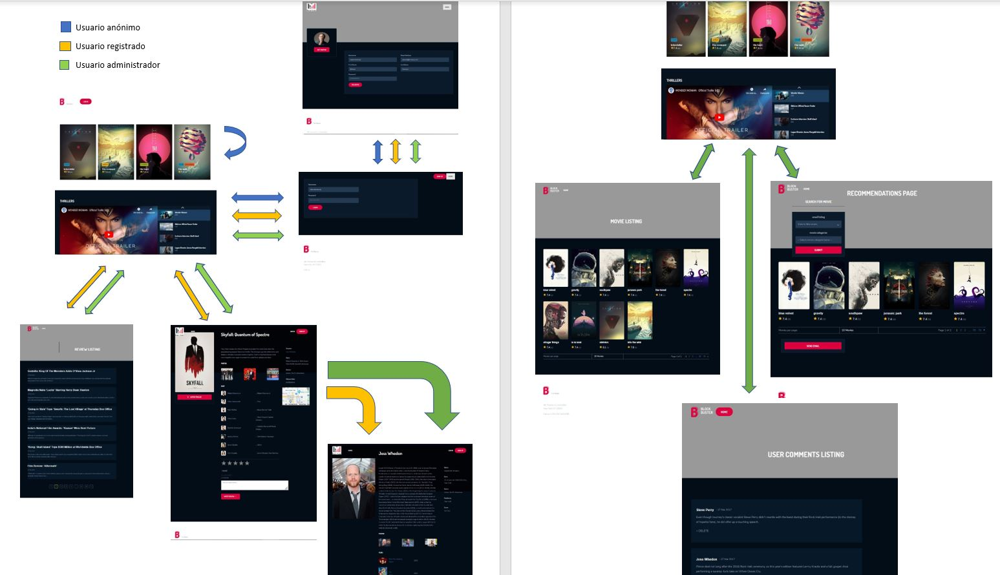

# MovieFrame

| Nombre y apellidos | Correo | Cuenta github |
| --- | --- | --- |
| Maria Amparo Alami | ma.alami.2020@alumnos.urjc.es | MaAlami2020 |
| Cristobal Justo Rustarazo | c.justo.2019@alumnos.urjc.es | CristobalJR |
| Cassiel Seth Mayorca Heirisman | cs.mayorca.2018@alumnos.urjc.es | cassiel_smh |
| Javier García Seller | j.garcias.2020@alumnos.urjc.es | Javarto |
| Shadith Perez  Rivera | sy.perez.2022@alumnos.urjc.es | Shadith |

#### Zona de organizacion [Trello](https://trello.com/w/movieframe)

## **1. Entidades:**
  - Usuario
  - Película o serie
  - Autor de la película
  - Crítica o reseña

## **2. Usuarios:**
  * **_Anónimo_**: no introduce ninguna credencial en la aplicación, se le muestra la cartelera de las películas y series más recientes o mejor calificadas.
  * **_Registrado_**: se registra en la aplicación (nombre, nombre de usuario, email(para mandarle recomendaciones), foto y contraseña).
  * **_Administrador_**: es el primer usuario que se registra en la app (nombre, nombre de usuario, email(para mandarle recomendaciones), foto, contraseña). La contraseña está cifrada en un fichero de configuración 

## **3. Permisos de los usuarios:**
  * **_Anónimo_**: visualiza la cartelera (nombres de peliculas, personajes, fecha de estreno, calificación media, trailer de la peli o serie...), no puede subir reseñas ni visualizar las de otros
  * **_Registrado_**: visualiza la cartelera, agrega/edita reseñas, vota películas o series, visualizar el histórico de reseñas realizadas
  * **_Administrador_**:visualiza la cartelera, agrega/edita reseñas, vota películas o series, visualizar el histórico de reseñas realizadas, eliminar reseñas de usuarios registrados, información no verificada y añadir películas o series a la app.

## **4. Imágenes:**
  * Fotos de portada las películas y series, cortas escenas, fotos de su elenco

## **5. Gráficos:**
  * Películas más taquilleras 
  * Peliculas mas populares (Un diagrama que clasifique las películas según el número de votos o número de reseñas)
  * Directores, actices y demas con mas premios
  
## **6. Tecnología complementaria:**
  * Usar "Google Maps" para mostrar el/los cines donde se puede ver una determinada película
  * Notificaciones de actulizaciones de los autores, peliculas y demas que sigues
  * Generar un PDF con recomendaciones de series y películas (cartel incluido) y que este sea enviado a los usuários mediante un mail

## **7. Algoritmo avanzado:**
  * Usuario registrado:
    * _Si no ha publicado ninguna reseña_: se le muestra la cartelera de películas y series más recientes (fecha más actual)
    * _si lo ha hecho_: se le muestra la cartelera de películas y series de un estilo similar al de las ya reseñadas por el usuario (ordenados de fecha más reciente a menos)

## **8. Pantallas de la aplicación:**
  * **_initial_screen_**:  cartelera con películas seleccionadas por el administrador, un traíler de las películas cargadas, un botón para hacer iniciar sesión, y gráficos con información cuantitativa sobre las películas
  * **_director_screen_**: se muestra la información personal del sujeto junto con un listado de sus pelis dirigidas y una valoración media de su trabajo
  * **_login_screen_**: dispone de campos para iniciar sesión, y un botón para registrarse en caso de no poder iniciar sesión
  * **_modification_reviews_screen_**: en este pantalla se muestra el listado de reseñas de todos los usuarios registrados en la app con un boton de eliminar en cada una de ellas, solo el administrador puede acceder a ella.
  * **_movie_aggregation_screen_**:en este pantalla se muestra un listado de peliculas aleatorias en la app con un boton de agregar en cada una de ellas, solo el administrador puede acceder a esta página
  * **_recommendations_screen_**:la pantalla tiene un buscador para filtrar por correo y categoría de película para mandar a un usuario registrado películas como recomendación, solo el administrador tiene acceso a esta página
  * **_movie_screen_**:se muestra la información de una película, enlace a la pantilla del director, botón para volver a la página de incio, cuadro de texto para escribir una reseña y cuadro para enviar una votación, además de un mapa para buscar cines
  * **_reviews_screen_**:página donde un usuario registrado puede ver todas sus reseñas hechas desde la primera vez que se dió de alta en la app
  * **_signup_screen_**:página con cuadros de diálogo para meter información y foto(opcional), y botón para volver a la página de inicio

